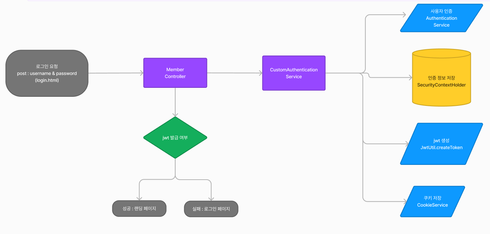

# 소개
## 이 프로젝트는 jWT 학습을 위한 프로젝트입니다.

<hr />


# 학습내용


## 1. JPA DDL 설정 
- JPA를 사용하여 데이터베이스 테이블을 자동으로 생성하고 관리하는 방법에는 여러 가지가 있습니다. 이 글에서는 각 설정의 특징과 추천 설정 방법에 대해 설명하겠습니다.


### 기본 설정
- spring.jpa.hibernate.ddl-auto=create
    - 이 설정을 사용하면 서버가 시작될 때마다 데이터베이스 테이블을 새로 생성합니다. 주의할 점은 매번 테이블을 새로 생성하기 때문에 기존 데이터가 모두 삭제된다는 점입니다.
      주의사항: 서버를 다시 시작할 때 이 설정을 그대로 두면 테이블이 계속해서 새로 생성되어 기존 데이터가 모두 지워집니다. 따라서, 서버 재시작 시에는 spring.jpa.hibernate.ddl-auto=none으로 변경하는 것이 좋습니다.


### 문제점과 해결 방안
- 위의 설정은 개발 초기 단계에서는 유용할 수 있지만, 실제 운영 환경에서는 매우 위험할 수 있습니다. 데이터를 계속 유지하면서 스키마 변경 사항만 반영하고 싶다면, 더 나은 방법이 있습니다.


### 해결방안:
- ```spring.jpa.hibernate.ddl-auto=update```
- 이 설정을 사용하면 JPA가 기존 데이터베이스 테이블을 유지하면서 변경 사항만 데이터베이스에 반영합니다. 데이터가 삭제되지 않고, 새로운 필드나 테이블이 추가될 때만 업데이트됩니다.
  이 방법은 개발 중간 단계 및 운영 환경에서도 안전하게 사용할 수 있습니다.


### 정리
- 따라서, 테이블을 처음 생성할 때는 spring.jpa.hibernate.ddl-auto=create를 사용하고, 이후에는 spring.jpa.hibernate.ddl-auto=update로 설정하여 데이터베이스 변경 사항만 반영하는 것이 좋습니다. 이렇게 하면 데이터 손실을 방지하고, 스키마 변경을 안전하게 관리할 수 있습니다.


### properties파일
### - 초기 테이블 생성 시
```spring.jpa.hibernate.ddl-auto=create```

### - 서버 재시작 또는 운영 시
```spring.jpa.hibernate.ddl-auto=update```


<hr />


## 2. Form 로그인 비활성화

SecurityConfig.java
```java
// Form 로그인 비활성화
    http.formLogin((auth) -> auth.disable());
```

### Form 로그인을 비활성화한 이유는 다음과 같습니다:

### - 필터 순서 문제
- 스프링 시큐리티는 로그인 요청을 처리할 때 여러 필터를 거칩니다. Form 로그인이 활성화되면 이 필터가 JWT 필터보다 먼저 실행되어 오류가 발생할 수 있습니다.

### - JWT 로그인 방식 사용
- JWT 로그인 방식을 사용하기 위해서는 Form 로그인 필터를 비활성화해야 합니다. 그렇지 않으면 JWT 필터가 정상적으로 작동하지 않을 수 있습니다.


### - 정리
- 따라서, http.formLogin((auth) -> auth.disable()); 코드를 통해 Form 로그인 방식을 비활성화합니다. 이를 통해 JWT 필터가 올바르게 작동하도록 설정합니다.
- 또한 이 필터를 커스텀하여 등록해야합니다.

<hr />


## Spring Security의 User와 CustomUser
- Spring Security를 사용하여 사용자 인증을 받을 때, 기본적으로 User 타입으로 인증을 받는다.
- 인증된 사용자 정보(auth 변수)에 내가 원하는 값을 추가하려면 CustomUser 클래스를 생성하여 User 클래스를 상속 받아야 한다.
- 이 프로젝트에서는 코드의 단순성과 유지보수성을 높이기 위해 CustomUser 대신 기본 제공되는 User 객체를 사용한다.

<hr />


## JWT 생성

### 1. [MemberController.java](src%2Fmain%2Fjava%2Fcom%2Fhanul%2FspringJWT%2Fcontroller%2FMemberController.java)
- POST 요청으로 전달된 로그인 정보와 쿠키 생성을 위한 `HttpServletResponse` 객체를 JWT와 쿠키 생성 함수에 전달합니다.

  ```html
  customAuthenticationService.authenticateAndSetCookie(username, password, response);
  ```

<br />

### 2. [CustomAuthenticationService.java](src%2Fmain%2Fjava%2Fcom%2Fhanul%2FspringJWT%2Fservice%2FCustomAuthenticationService.java)`CustomAuthenticationService.java`
- 전달 받은 값으로 사용자 인증, 인증 정보 저장, JWT 생성, 그리고 쿠키 저장을 처리합니다.

```java
public void authenticateAndSetCookie(String username, String password, HttpServletResponse response) {
  try {
        // 사용자 인증
        Authentication authentication = authenticationService.authenticate(username, password);

        // 인증 성공 시 SecurityContextHolder에 인증 정보 저장
        SecurityContextHolder.getContext().setAuthentication(authentication);

        // JWT 생성
        String jwtToken = JwtUtil.createToken(authentication);

        // 생성한 JWT를 쿠키에 저장
        cookieService.addJwtCookie(response, jwtToken);

    } catch (Exception e) {
        throw new RuntimeException("로그인 증명 실패: " + e.getMessage());
    }
}
```
<br />
<br />

### 2-1. [MyUserDetailsService.java](src%2Fmain%2Fjava%2Fcom%2Fhanul%2FspringJWT%2Fservice%2FMyUserDetailsService.java)
- authenticationService.authenticate(username, password) 코드가 실행되기 전에 MyUserDetailsService.java가 실행됩니다.
- 로그인 정보와 데이터베이스 정보를 비교하여 일치하는 경우 User 타입 객체를 반환하여 인증 절차를 진행합니다.


### 2-2. [JwtUtil.java](src%2Fmain%2Fjava%2Fcom%2Fhanul%2FspringJWT%2Fjwt%2FJwtUtil.java)
- createToken 메서드를 통해 JWT를 생성합니다.
- 이 메서드에서 JWT에 추가할 정보를 설정할 수 있습니다. 그러나 이 정보는 MyUserDetailsService에서 반환한 User 타입과 일치해야 합니다.
- 만약 User 타입을 변경하고 싶다면, User 타입을 상속한 새로운 클래스를 생성하여 필요한 정보를 추가할 수 있습니다.


### 2-3. [CookieService.java](src%2Fmain%2Fjava%2Fcom%2Fhanul%2FspringJWT%2Fservice%2FCookieService.java)
- 쿠키의 유효기간 등 다양한 속성을 설정할 수 있습니다.

<br />

### 3. [MemberController.java](src%2Fmain%2Fjava%2Fcom%2Fhanul%2FspringJWT%2Fcontroller%2FMemberController.java)
JWT 발급이 성공하면 랜딩 페이지로 이동합니다.
실패하면 로그인 페이지로 리다이렉트합니다.

<br />


### 4. 순서도


<hr />
<hr />

## jwt 인증

### 1. 어디에서 시작
 - 어디에서 시작합니다